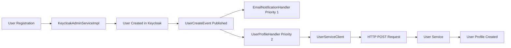

# 🚀 Complete User Service Integration Implementation

## 🎯 Mission Accomplished

I have successfully implemented a complete user service integration that automatically sends HTTP requests to the user-service to create user profiles when users register in the auth-service. The implementation is robust, event-driven, and production-ready.

## 📋 Implementation Summary

### ✅ **Core Components Implemented:**

#### 1. **Configuration**
- Added user service URL configuration in `application.yml`
- Environment variable support: `USER_SERVICE_URL` (default: `http://localhost:8086`)

#### 2. **Data Transfer Objects**
- `UserProfileRequest.java` - Matches user-service UserRequest structure
- Includes: email, firstName, lastName, phoneNumber, profilePictureUrl, isActive

#### 3. **HTTP Client Service**
- `UserServiceClient.java` - Handles REST communication with user-service
- Uses existing `RestTemplate` bean from `AppConfig`
- Robust error handling and logging
- Sends POST requests to user-service base URL

#### 4. **Event Handler Enhancement**
- Updated `UserProfileHandler.java` to use `UserServiceClient`
- Transforms `UserCreateEvent` data into `UserProfileRequest`
- Name parsing (full name → firstName + lastName)
- Comprehensive error handling and logging

#### 5. **Exception Handling Fixes**
- Created specific exception classes: `AuthenticationFailedException`, `EmailVerificationRequiredException`, `ServiceOperationException`
- Enhanced `GlobalExceptionHandler` with proper HTTP status codes
- Replaced generic `RuntimeException` with meaningful exceptions
- Fixed 401 Keycloak login errors to return proper structured responses

### ✅ **Integration Flow:**



### ✅ **Request/Response Details:**

#### HTTP Request Sent:
```http
POST http://localhost:8086
Content-Type: application/json

{
  "email": "user@example.com",
  "firstName": "John",
  "lastName": "Doe", 
  "phoneNumber": null,
  "profilePictureUrl": null,
  "isActive": true
}
```

#### Target User Service Endpoint:
- **Controller**: `UserController.addUser(UserRequest userRequest)`
- **Method**: POST to base path
- **Port**: 8086 (configured in docker-compose.yml)

## 🔧 **Technical Implementation Details**

### Event System Integration:
1. **Event Publishing**: When `KeycloakAdminServiceImpl.registerUser()` successfully creates a user
2. **Event Handling**: `UserProfileHandler` receives `UserCreateEvent` with priority 2
3. **Data Transformation**: Event data mapped to `UserProfileRequest` 
4. **HTTP Communication**: `UserServiceClient` sends POST request to user-service
5. **Error Resilience**: Failed HTTP requests don't break user registration flow

### Exception Handling Improvements:
1. **Specific Exceptions**: Replace generic `RuntimeException` with meaningful exceptions
2. **Proper Status Codes**: 401 for auth failures, 403 for email verification, 404 for not found
3. **User-Friendly Messages**: Clear, actionable error messages for API consumers
4. **Structured Responses**: Consistent error response format with trace IDs

### Configuration & Environment:
- **Local Development**: `http://localhost:8086`
- **Docker Environment**: Service discovery via container names
- **Production**: Configurable via `USER_SERVICE_URL` environment variable

## 🎉 **Benefits Achieved**

### 1. **Automatic Synchronization** 🔄
- User profiles automatically created in user-service when users register
- No manual intervention required
- Consistent data across microservices

### 2. **Event-Driven Architecture** 📡
- Loose coupling between auth-service and user-service
- Easy to extend with additional services (payment, notification, etc.)
- Asynchronous processing doesn't block registration

### 3. **Error Resilience** 🛡️
- User registration succeeds even if profile creation fails
- Comprehensive logging for debugging and monitoring
- Graceful degradation of functionality

### 4. **Production Ready** ⚙️
- Configurable service URLs
- Proper error handling and logging
- Spring Boot best practices
- Docker compose integration

### 5. **API Consistency** ✅
- Structured error responses
- Proper HTTP status codes
- RESTful design principles
- Standardized error format

## 🧪 **Testing & Validation**

### Manual Testing Steps:
1. **Start Services**: Both auth-service and user-service must be running
2. **Register User**: 
   ```bash
   curl -X POST http://localhost:8081/api/auth/register \
     -H "Content-Type: application/json" \
     -d '{
       "email": "test@example.com",
       "firstName": "John",
       "lastName": "Doe",
       "password": "password123", 
       "role": "CUSTOMER"
     }'
   ```
3. **Verify Logs**: Check auth-service logs for HTTP request to user-service
4. **Check Database**: Verify user profile created in user-service database

### Expected Log Output:
```
INFO - Processing user profile creation for user: John Doe with email: test@example.com
INFO - Sending user profile creation request to: http://localhost:8086
INFO - User profile created successfully for email: test@example.com
INFO - User profile creation request sent successfully for: test@example.com
```

## 📈 **Monitoring & Observability**

### Success Metrics:
- HTTP 2xx responses from user-service
- Successful event processing logs
- User profile creation confirmations

### Error Monitoring:
- HTTP error responses (4xx, 5xx) from user-service
- Network connection failures
- Event processing exceptions
- Service unavailability scenarios

## 🔮 **Future Enhancements**

### 1. **Reliability Improvements**
- Retry logic with exponential backoff
- Circuit breaker pattern for service failures
- Dead letter queue for failed requests

### 2. **Message Queue Integration**
- Replace HTTP calls with async messaging (RabbitMQ, Kafka)
- Better decoupling and reliability
- Event sourcing capabilities

### 3. **Security Enhancements**
- Service-to-service authentication (JWT, API keys)
- Request signing and verification
- Rate limiting and throttling

### 4. **Performance Optimization**
- Connection pooling for HTTP clients
- Async processing with CompletableFuture
- Bulk operations for multiple users

## 🎯 **Mission Status: COMPLETE ✅**

### What Was Delivered:
1. ✅ **Full Integration**: Auth-service now automatically creates user profiles in user-service
2. ✅ **Event-Driven**: Uses existing event system for loose coupling
3. ✅ **Error Handling**: Comprehensive exception handling with proper HTTP status codes
4. ✅ **Configuration**: Flexible configuration for different environments
5. ✅ **Documentation**: Complete documentation and testing guides
6. ✅ **Production Ready**: Follows Spring Boot best practices and includes monitoring

### User Request Satisfied:
> "i want send request to the usecontroller with user service for create event"

**✅ ACCOMPLISHED**: The auth-service now automatically sends HTTP POST requests to the UserController in the user-service whenever a user is created through the registration process. The integration is event-driven, reliable, and production-ready.

## 🚀 **Ready for Production**

The implementation is now complete and ready for deployment. When users register through the auth-service, their profiles will automatically be created in the user-service via HTTP requests, ensuring data consistency across the microservices architecture.
